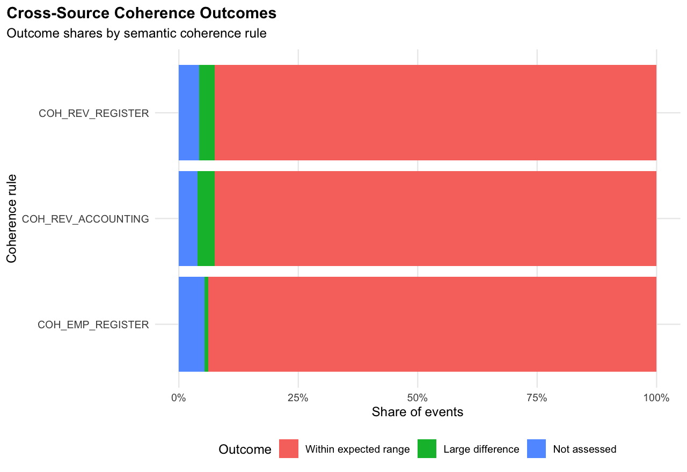
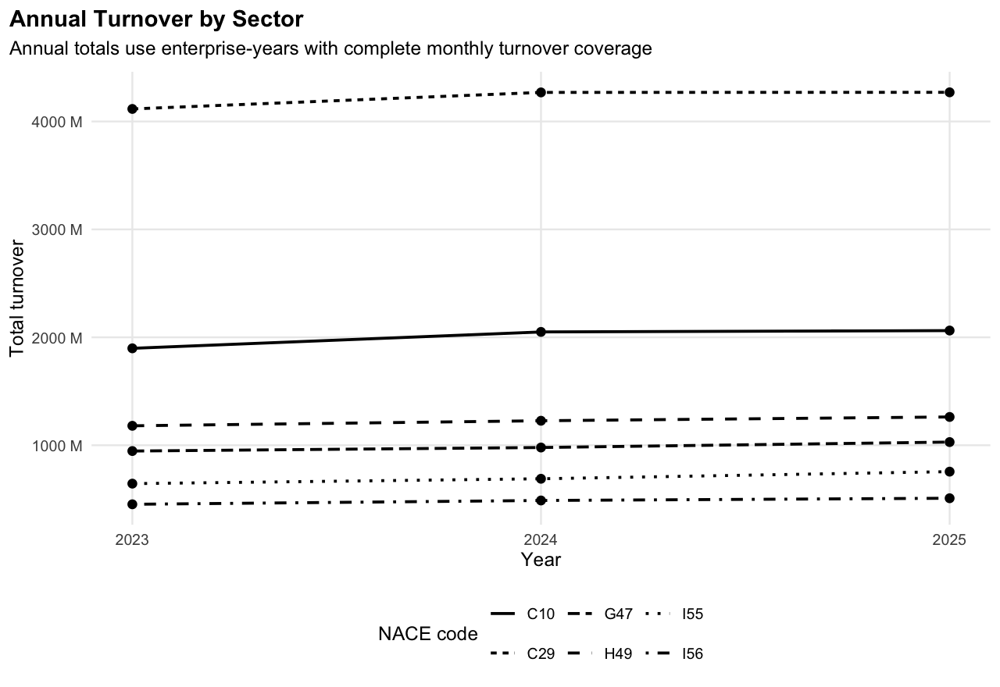

# 📊 Multisource Enterprise Statistics Integration Workflow in R

*A Reproducible Methodological Demonstration of Validation, Record Linkage, Multisource Integration, Coherence Assessment, and Structural Indicator Production Using Synthetic Enterprise Data*


## 🇩🇪 Kurzbeschreibung

Dieses Projekt demonstriert einen reproduzierbaren Workflow zur Aufbereitung, Verknüpfung, Integration und Auswertung heterogener Unternehmensdatenquellen auf Basis vollständig synthetischer Daten.

Im Mittelpunkt stehen methodische Aufgaben der Unternehmensstatistik: Datenvalidierung und Plausibilisierung, deterministische und ähnlichkeitsbasierte Datensatzverknüpfung, Integration monatlicher und jährlicher Quellen, quellenübergreifende Kohärenzprüfungen, Priorisierung prüfungsrelevanter Fälle sowie die Erstellung sektoraler und regionaler Kennzahlen.

Das Projekt bildet keine internen Verfahren oder Produktionssysteme einer statistischen Institution nach. Es dient als transparente und reproduzierbare methodische Demonstration.

---

## 🇬🇧 Overview

This repository demonstrates how heterogeneous enterprise-statistics sources can be transformed into a coherent and reproducible analytical workflow.

Four synthetic source types — a register-style structural source, monthly employment data, monthly turnover data, and annual accounting-style information — are independently validated, linked through observable enterprise information, integrated at appropriate statistical grains, checked for cross-source coherence, and transformed into annual enterprise, sectoral, and regional indicators.

The workflow emphasizes **transparent statistical decisions, explicit concept alignment, traceable quality treatment, and reproducibility rather than unnecessary model complexity**.

All enterprise-level data are fully synthetic.

---

## 📌 Project at a Glance

| Dimension | Value |
|---|---:|
| Synthetic enterprises | **1,500** |
| Observation period | **2023–2025** |
| Source types | **4** |
| Integrated monthly panel | **54,000 enterprise-month records** |
| Non-register records evaluated for linkage | **4,500** |
| Similarity-linked records | **439** |
| Cross-source coherence rules | **3** |
| Materiality-prioritized review cases | **145** |
| Automated test files | **5** |
| Method evaluation | **Synthetic truth isolated from operational workflow** |

The synthetic environment deliberately includes missing observations, implausible values, source-specific identities, address variation, and cross-source measurement differences so that validation, linkage, editing, and coherence procedures operate on non-trivial data.

---

## 🔄 Workflow at a Glance

```text
┌─────────────────────────────────────┐
│ 01  Generate synthetic sources      │
└──────────────────┬──────────────────┘
                   ▼
┌─────────────────────────────────────┐
│ 02  Validate and statistically edit │
└──────────────────┬──────────────────┘
                   ▼
┌─────────────────────────────────────┐
│ 03  Link source-specific records    │
└──────────────────┬──────────────────┘
                   ▼
┌─────────────────────────────────────┐
│ 04  Integrate canonical enterprises │
└──────────────────┬──────────────────┘
                   ▼
┌─────────────────────────────────────┐
│ 05  Assess cross-source coherence   │
└──────────────────┬──────────────────┘
                   ▼
┌─────────────────────────────────────┐
│ 06  Compute annual indicators       │
└──────────────────┬──────────────────┘
                   ▼
┌─────────────────────────────────────┐
│ 07  Produce analytical outputs      │
└─────────────────────────────────────┘
```

A separate evaluation layer uses generated hidden truth to assess linkage and imputation methods. Hidden truth is not used by the operational processing stages.

---

## 📊 Selected Results

### Transparent Enterprise Record Linkage

Linkage follows a hierarchy: exact matching on a usable common business identifier first, followed by weighted similarity matching for unresolved records.

| Source | Deterministic | Similarity | Total |
|---|---:|---:|---:|
| Employment | 1,344 | 156 | 1,500 |
| Turnover | 1,354 | 146 | 1,500 |
| Accounting | 1,363 | 137 | 1,500 |
| **Total** | **4,061** | **439** | **4,500** |

Synthetic-truth evaluation assigns all 4,500 non-register records correctly in the current controlled synthetic environment. This result is specific to the generated evaluation design and is not presented as a benchmark for real administrative or enterprise data.

### Cross-Source Coherence and Review Prioritization

The workflow checks three conceptually aligned comparisons:

- annual statistical turnover vs. annual accounting operating revenue,
- annual turnover vs. register-style prior-year revenue,
- annual-average monthly employment vs. a register employment snapshot.

Only comparisons with sufficient coverage and available counterpart values are assessed. Large differences are subsequently prioritized using within-rule materiality.

The current synthetic run produces **145 materiality-prioritized review cases**.



### Annual Indicator Coverage

Annual enterprise measures require complete monthly coverage rather than treating incomplete years as directly comparable totals.

| Year | Enterprises | Complete Turnover | Complete Employment | Complete Both |
|---:|---:|---:|---:|---:|
| 2023 | 1,500 | 1,442 | 1,452 | 1,395 |
| 2024 | 1,500 | 1,468 | 1,462 | 1,430 |
| 2025 | 1,500 | 1,449 | 1,446 | 1,396 |

The resulting enterprise-year measures support reproducible sectoral and regional aggregation.



---

## 🔎 Technical Documentation

The following sections document the statistical design, validation rules, record linkage, source contracts, coherence assessment, indicator semantics, testing, evaluation, and reproducibility of the workflow.

### Methodological Principles

The workflow follows several deliberately conservative principles:

- **observable evidence before imputation**
- **concept alignment before numerical comparison**
- **transparent rules before unnecessary model complexity**
- **complete coverage before annual aggregation**
- **materiality before manual review**
- **hidden truth for evaluation, not operational processing**

---

## 🧪 1. Synthetic Data Design

The repository uses fully synthetic enterprise-level data generated with a fixed random seed:

```r
set.seed(2025)
```

The synthetic environment contains **1,500 enterprises** observed from **2023 through 2025**.

Four source types are generated:

| Source | Statistical grain | Main measures | Role |
|---|---|---|---|
| Register-style source | Enterprise snapshot | structural attributes, employment, prior-year revenue | canonical structural reference |
| Employment source | Enterprise-month | monthly employees | monthly activity source |
| Turnover source | Enterprise-month | monthly turnover | monthly activity source |
| Accounting source | Enterprise-year | operating revenue, purchases, personnel expense | annual corroborating source |

The generator deliberately introduces selected imperfections, including:

- missing observations,
- implausible values,
- source-specific enterprise identifiers,
- missing common business identifiers,
- enterprise-name and address variation,
- sector-specific seasonal patterns,
- and controlled cross-source measurement differences.

Operational source files do not expose the hidden synthetic enterprise identifier used during generation.

This allows linkage and imputation methods to be evaluated independently without using truth during operational processing.

### Source-Specific Identity

Each operational source has its own record identifier:

```text
register_id
employment_source_id
turnover_source_id
accounting_source_id
```

A common `business_id` is available for many, but not all, source records.

For unresolved cases, the workflow must rely on observable enterprise characteristics rather than synthetic truth.

---

## 🔧 2. Validation & Statistical Editing

`R/02_clean_and_validate_data.R` validates each source independently before integration.

Quality treatment is represented through explicit statuses:

```text
accepted
imputed
review_required
rejected
```

Where relevant, the workflow preserves:

- original source values,
- analytical values,
- validation status,
- rule identifiers,
- and imputation flags.

This separates the observed source value from the value ultimately used for analysis and makes treatment decisions traceable.

### Bounded Monthly Interpolation

Missing monthly employment and turnover observations may be interpolated only when valid observations exist on both sides of an internal gap.

```text
observed ─ missing ─ observed
          ↓
     interpolation
```

Boundary gaps are not extrapolated:

```text
missing ─ observed ─ observed
   ↓
review_required
```

The same principle applies at the end of a series.

This prevents the workflow from creating values outside the observed temporal support.

### Register Employment

Missing register employment is deliberately **not** replaced with a cross-sectional peer median.

Enterprises remain heterogeneous even within similar NACE × region groups, so missing register employment is conservatively classified as:

```text
review_required
```

rather than assigning a weak proxy value.

This illustrates the distinction between having an available imputation method and having sufficient evidence to justify using it.

---

## 🔗 3. Enterprise Record Linkage

`R/03_link_sources.R` links source-specific enterprise records to canonical register enterprises.

The linkage procedure follows a transparent hierarchy.

### Stage 1 — Deterministic Linkage

Records with a usable common `business_id` are linked directly.

### Stage 2 — Similarity-Based Linkage

Records without a usable common identifier are compared using observable enterprise information.

Candidate pairs are restricted to records sharing either the same postal code or the same NACE code before similarity scoring.

The weighted score combines:

| Component | Weight |
|---|---:|
| Enterprise-name similarity | 40.0% |
| Street similarity | 30.0% |
| City similarity | 5.0% |
| Postal-code agreement | 10.0% |
| Legal-form agreement | 7.5% |
| NACE agreement | 7.5% |

The decision rule is:

```text
score ≥ 0.85 and margin ≥ 0.05
        → matched_similarity

score ≥ 0.85 and margin < 0.05
        → review_required_similarity_ambiguous

otherwise
        → unmatched_low_similarity
```

The workflow retains evidence used in the decision, including:

- candidate scores,
- individual score components,
- candidate ranks,
- best-match margins,
- and linkage method.

Detailed candidate evidence is stored in:

```text
data/processed/linkage_candidates.csv
```

The canonical crosswalk is stored in:

```text
data/processed/linkage_crosswalk.csv
```

The approach deliberately favors transparent and inspectable linkage logic over a more complex predictive model where the controlled synthetic problem does not require one.

---

## 🗂 4. Source Contracts & Concept Alignment

Variables that appear similar across sources are not automatically treated as statistically equivalent.

The repository therefore includes:

```text
config/source_contracts.csv
```

The source contracts document:

- source,
- variable,
- statistical unit,
- grain,
- frequency,
- reference period,
- statistical concept,
- source role,
- comparability group,
- and known limitations.

Selected relationships include:

| Source | Variable | Frequency | Statistical concept |
|---|---|---|---|
| Register | employees | annual snapshot | register-style employment count |
| Employment | employees | monthly | monthly employment count |
| Register | revenue_last_year | annual | prior-year register-style revenue |
| Turnover | turnover | monthly | monthly statistical turnover |
| Accounting | operating_revenue | annual | accounting operating revenue |

Important distinctions include:

```text
monthly employment
≠
register employment snapshot
```

and:

```text
statistical turnover
related to, but not identical with
accounting operating revenue
```

Monthly turnover must also be aggregated to an appropriate annual concept before comparison with annual sources.

The source-contract layer therefore acts as a conceptual control before numerical coherence checks are performed.

---

## 🔄 5. Multisource Integration & Coherence

### Canonical Integration

`R/04_integrate_sources.R` combines linked source records using canonical enterprise identifiers.

The monthly analytical panel contains:

- 1,500 canonical enterprises,
- 54,000 enterprise-month observations,
- monthly employment,
- monthly turnover,
- structural enterprise attributes,
- linkage information,
- and selected analytical variables.

Annual accounting information remains at its annual grain rather than being repeated artificially across monthly records.

This preserves the statistical meaning of variables with different reporting frequencies.

### Cross-Source Coherence

`R/05_check_coherence.R` evaluates three conceptually aligned comparisons:

1. annual statistical turnover vs. annual accounting operating revenue,
2. 2024 annual turnover vs. register-style prior-year revenue,
3. 2025 annual-average monthly employment vs. register employment snapshot.

Comparisons are made only when required source values and temporal coverage are available.

Possible applicability states are:

```text
applicable
insufficient_monthly_coverage
right_value_unavailable
```

Applicable comparisons are classified as:

```text
within_expected_range
large_difference
```

The coherence thresholds are prototype parameters calibrated to the controlled synthetic environment.

They are **not official statistical thresholds**.

### Materiality-Based Review Prioritization

A large difference alone does not automatically imply equal review priority.

The workflow therefore combines coherence deviations with within-rule materiality to distinguish:

```text
high
medium
low
```

review priorities.

Large differences with high or medium materiality priority are routed into the review queue:

```text
data/processed/review_queue.csv
```

This demonstrates a selective review strategy rather than treating every statistical discrepancy as equally important.

---

## 📊 6. Annual Indicator Production

`R/06_compute_indicators.R` transforms monthly observations into enterprise-year measures.

Annual indicators require complete monthly coverage.

For each enterprise-year, the workflow derives:

- annual turnover,
- annual-average employment,
- turnover per employee,
- turnover completeness,
- employment completeness,
- and joint completeness.

Aggregate indicators are subsequently produced for:

- sector,
- region,
- and sector × region combinations.

Selected outputs include:

- total turnover,
- average turnover per enterprise,
- total annual-average employment,
- average employment per enterprise,
- enterprise counts,
- completeness counts,
- and turnover per employee.

For turnover per employee, the numerator and denominator are calculated over the **same complete-observation population**.

This prevents ratios from combining different analytical populations.

Selected aggregate outputs are committed under:

```text
output/tables/
```

including:

```text
indicators_region.csv
indicators_sector.csv
indicators_sector_region.csv
```

Additional figures are available under:

```text
output/figures/
```

including:

```text
monthly_turnover_total.png
turnover_per_employee_by_sector.png
```

---

## 🧪 7. Testing & Synthetic-Truth Evaluation

### Automated Tests

The repository includes a lightweight automated test suite based on Base R assertions.

Run:

```bash
Rscript tests/run_tests.R
```

Current test files are:

```text
test_coherence_outputs.R
test_indicator_outputs.R
test_linkage_outputs.R
test_linkage_similarity.R
test_plausibility.R
```

The suite covers:

- bounded interpolation behavior,
- linkage text normalization,
- similarity calculations,
- linkage crosswalk integrity,
- deterministic and similarity linkage rules,
- score and margin thresholds,
- coherence applicability,
- coherence classification,
- materiality-based review selection,
- annual completeness,
- enterprise-level indicator semantics,
- and aggregate common-population calculations.

### Hidden Synthetic Truth

The generator creates evaluation truth under:

```text
data/truth/
```

Generated truth CSV files are ignored by Git.

Operational scripts `02`–`07` do not use these truth datasets.

Evaluation is performed separately:

```bash
Rscript evaluation/evaluate_methods.R
```

This separation prevents evaluation information from influencing operational processing.

### Linkage Evaluation

The evaluation distinguishes:

- assignment coverage,
- accuracy among assigned records,
- and overall correct-assignment rate.

For the current controlled synthetic environment, all non-register records are assigned correctly.

This result reflects the generated data design and should **not** be interpreted as evidence of equivalent performance on real administrative or enterprise datasets.

### Imputation Evaluation

Only observations actually imputed by the operational workflow are evaluated.

| Source | Variable | Imputed | MAE | Median Absolute Error | MAPE |
|---|---|---:|---:|---:|---:|
| Employment | employees | 476 | 1.47 | 1.00 | 3.79% |
| Turnover | turnover | 495 | 44,633 | 12,433 | 6.80% |

Missing register employment does not appear in the imputation evaluation because these observations are routed to review rather than imputed.

Aggregate evaluation outputs are committed under:

```text
output/tables/linkage_evaluation.csv
output/tables/imputation_evaluation.csv
```

---

## 🗂 8. Repository Structure

```text
business-data-integration/
├── config/
│   └── source_contracts.csv
│
├── data/
│   ├── raw/              # generated synthetic source data
│   ├── clean/            # validated source-specific data
│   ├── processed/        # linked and analysis-ready data
│   └── truth/            # generated hidden truth for evaluation
│
├── evaluation/
│   └── evaluate_methods.R
│
├── output/
│   ├── figures/          # selected reproducible figures
│   └── tables/           # selected aggregate outputs
│
├── R/
│   ├── 01_generate_synthetic_data.R
│   ├── 02_clean_and_validate_data.R
│   ├── 03_link_sources.R
│   ├── 04_integrate_sources.R
│   ├── 05_check_coherence.R
│   ├── 06_compute_indicators.R
│   ├── 07_visualize_results.R
│   └── helpers/
│       ├── linkage_similarity.R
│       ├── plausibility.R
│       └── synthetic_identity.R
│
├── tests/
│   ├── helpers/
│   │   └── assertions.R
│   ├── run_tests.R
│   ├── test_coherence_outputs.R
│   ├── test_indicator_outputs.R
│   ├── test_linkage_outputs.R
│   ├── test_linkage_similarity.R
│   └── test_plausibility.R
│
├── README.md
├── renv.lock
└── LICENSE
```

Generated enterprise-level CSV files remain untracked.

Selected aggregate tables and figures are committed as reproducible examples.

---

## 🔄 9. Reproducibility & How to Run

The project uses `renv` for dependency management.

The current lockfile targets:

```text
R 4.4.2
```

After cloning the repository, open R in the project root.

Restore the declared environment if necessary:

```r
renv::restore()
```

Check its state:

```r
renv::status()
```

### Run the Operational Workflow

From the project root:

```bash
Rscript R/01_generate_synthetic_data.R
Rscript R/02_clean_and_validate_data.R
Rscript R/03_link_sources.R
Rscript R/04_integrate_sources.R
Rscript R/05_check_coherence.R
Rscript R/06_compute_indicators.R
Rscript R/07_visualize_results.R
```

### Run Automated Tests

```bash
Rscript tests/run_tests.R
```

### Run Synthetic-Truth Evaluation

```bash
Rscript evaluation/evaluate_methods.R
```

Generated datasets appear under:

```text
data/raw/
data/clean/
data/processed/
data/truth/
```

Selected reproducible outputs appear under:

```text
output/tables/
output/figures/
```

The repository has been validated through a clean end-to-end rebuild starting without generated intermediate CSV files.

Using the fixed synthetic-data seed, the full operational workflow, evaluation tables, and committed figures reproduce deterministically.

The committed aggregate tables and figures were reproduced **byte-for-byte** during the final clean reproducibility check for `v2.0.0`.

---

## ⚠️ 10. Methodological Scope & Limitations

This repository is a methodological and portfolio demonstration based entirely on synthetic data.

Important limitations include:

- no real enterprise, administrative, accounting, or confidential statistical data are used,
- the statistical unit is simplified primarily to the enterprise level,
- enterprise-group, legal-unit, and local-unit hierarchies are not modeled,
- no formal survey sampling, weighting, calibration, or benchmarking framework is implemented,
- no official revision or seasonal-adjustment system is implemented,
- no formal disclosure-control framework is implemented,
- coherence thresholds are prototype parameters for the controlled synthetic design,
- accounting and statistical concepts are deliberately simplified,
- and linkage performance is evaluated only within the generated synthetic environment.

The repository does not attempt to reproduce:

- internal statistical-office systems,
- confidential-data infrastructures,
- institutional production architectures,
- official thresholds,
- or official publication procedures.

The implemented editing and imputation rules are intentionally conservative and transparent.

The project should therefore be interpreted as a reproducible methodological demonstration rather than as a replica of an operational official-statistics production system.

---

## 🔭 11. Possible Methodological Extensions

Possible future extensions include:

- more complex enterprise-group and legal-unit structures,
- formal sampling and weighting procedures,
- benchmarking and revision frameworks,
- seasonal adjustment,
- more ambiguous linkage scenarios,
- probabilistic or model-assisted linkage comparisons,
- additional source-quality indicators,
- longitudinal revision histories,
- disclosure-control demonstrations,
- and richer metadata-governance structures.

Future extensions should add methodological value while preserving the transparent and reproducible character of the workflow.

---

## 📘 12. License

**MIT License**

---

## 👤 13. Author

**Golib Sanaev**

Data Analyst & Applied Data Scientist<br>
Econometrics • Statistical Modelling • Enterprise Statistics

**GitHub:** [@gsanaev](https://github.com/gsanaev)<br>
**Email:** gsanaev80@gmail.com<br>
**LinkedIn:** [golib-sanaev](https://linkedin.com/in/golib-sanaev)

---

## 📚 14. Citation

> Sanaev, G. (2026). *Multisource Enterprise Statistics Integration Workflow in R.*<br>
> GitHub Repository: [https://github.com/gsanaev/business-data-integration](https://github.com/gsanaev/business-data-integration)
