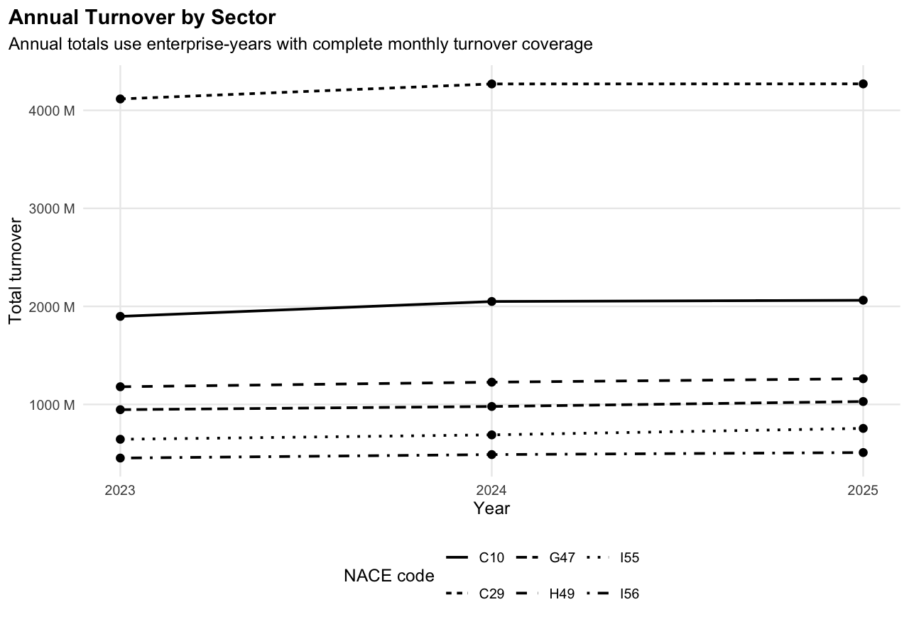
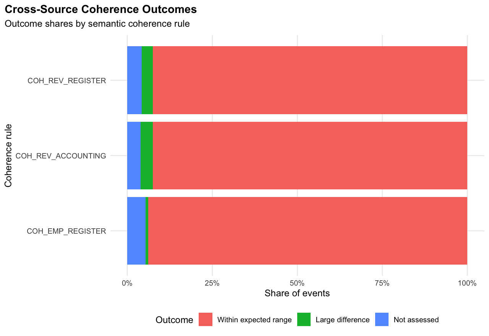

# 📊 Multisource Enterprise Statistics Integration Workflow in R

*Reproducible enterprise-data integration, record linkage, selective automation, and statistical quality assessment using fully synthetic data.*


## 🇩🇪 Kurzbeschreibung

Dieses Projekt demonstriert einen reproduzierbaren Workflow zur Aufbereitung, Verknüpfung, Integration und statistischen Auswertung heterogener Unternehmensdatenquellen auf Basis vollständig synthetischer Daten.

Im Mittelpunkt stehen mehrstufige Datensatzverknüpfung, selektive Automatisierung, quellenübergreifende Qualitätsprüfung und die Frage, wie Linkage-Entscheidungen nachgelagerte Unternehmensstatistiken beeinflussen.

Das Projekt bildet keine internen Verfahren oder Produktionssysteme einer statistischen Institution nach, sondern dient als transparente methodische Demonstration.

---

## Overview

The project integrates four synthetic enterprise-data sources:

- a register-style structural source,
- monthly employment data,
- monthly turnover data,
- annual accounting-style data.

The workflow follows a simple principle:

> **Machine learning is one component of the statistical process, not the project itself.**

It combines deterministic linkage, candidate generation, weighted similarity, Random Forest candidate scoring, explicit review outcomes, statistical integration, coherence checks, indicator production, and downstream evaluation.

### Project at a glance

| Dimension | Current v3 workflow |
|---|---:|
| Synthetic enterprises | **1,500** |
| Observation period | **2023–2025** |
| Source types | **4** |
| Identity stress scenarios | **3** |
| Development / held-out split | **70% / 30% of enterprises** |
| Held-out source-record decisions per method | **4,050** |
| Level-1 deterministic links | **2,882 (71.2%)** |
| Level-2 records | **1,168 (28.8%)** |
| Workflow targets | **61** |
| Automated test files | **21** |

The baseline, moderate, and difficult identity scenarios are controlled experimental stress settings. Their corruption rates are **not estimates of real administrative-data error rates**.

---

## Workflow

The repository separates **operational processing** from **method evaluation**.

```text
Operational workflow

Synthetic sources
      ↓
Validation
      ↓
Level 1: trusted valid identifier
      ↓
Level 2: candidate generation
      ↓
Weighted-similarity linkage
      ↓
Canonical integration
      ↓
Cross-source coherence
      ↓
Enterprise-year indicators
      ↓
Tables + figures
```

```text
Method-evaluation layer

Controlled identity scenarios
baseline · moderate · difficult
              ↓
    70% development / 30% held-out
              ↓
       Level-2 candidates
          ↙         ↘
   Weighted         Random
   similarity        Forest
          ↘         ↙
     Policy evaluation
              ↓
     Held-out comparison
              ↓
Downstream statistical impact
```

Hidden synthetic truth is used only for methodological evaluation. Operational processing relies on observable source information.

Model and policy selection use development enterprises only; the held-out sample is reserved for final linkage and downstream evaluation.

---

## Methodological Design

### 1. Synthetic data and controlled identity degradation

Synthetic data are generated with a fixed seed and preserve separate source-specific identities.

The three evaluation scenarios progressively introduce controlled problems such as:

- missing or invalid identifiers,
- enterprise-name degradation,
- street discrepancies,
- postal-code problems,
- NACE disagreement,
- legal-form disagreement.

These scenarios are methodological stress tests rather than representations of any specific institutional data-generating process.

### 2. Two-level record linkage

**Level 1** resolves records when a trusted valid common identifier is available.

**Level 2** handles unresolved records through candidate generation and common linkage features:

- enterprise-name similarity,
- street similarity,
- city similarity,
- postal-code agreement,
- legal-form agreement,
- NACE agreement.

Candidate generation uses transparent blocking rules.

The same candidate evidence supports two Level-2 approaches:

- **weighted similarity**
- **Random Forest**

The development sample is used for grouped cross-validation, model configuration, and decision-policy selection. The held-out sample is not used for tuning.

### 3. Selective automation

Both Level-2 methods use a score or probability threshold together with a best-versus-second-best margin.

A decision can therefore be:

```text
automatically linked
review_required
unmatched
```

This avoids treating forced assignment as the only possible outcome.

### 4. Statistical integration and downstream evaluation

Linked source records are integrated at their appropriate statistical grains.

Monthly observations are transformed into enterprise-year measures before sectoral and regional aggregation.

The downstream evaluation asks:

> **How do linkage and selective-review decisions propagate into enterprise counts, employment, turnover, and turnover-per-employee statistics?**

This separates record-level linkage quality from its statistical consequences.

---

## Selected Results

### Held-out linkage evaluation

Frozen linkage policies are evaluated on **4,050 held-out source-record decisions per method** across the baseline, moderate, and difficult scenarios.

| Metric | Weighted similarity | Random Forest |
|---|---:|---:|
| Level-1 deterministic links | 2,882 | 2,882 |
| Level-2 records | 1,168 | 1,168 |
| Automatic links | 4,050 | 4,046 |
| Correct automatic links | 4,046 | 4,044 |
| False automatic links | 4 | 2 |
| Review records | 0 | 2 |
| Unmatched records | 0 | 2 |
| Automatic-link precision | 99.90% | 99.95% |
| Automation rate | 100.00% | 99.90% |

Baseline and moderate scenarios are resolved without final linkage error by either method.

Differences appear in the difficult scenario. The Random Forest policy produces fewer false automatic links, while withholding a small number of cases for review or leaving them unmatched.

This is not interpreted as a universal method ranking. The approaches represent different error-versus-coverage trade-offs.

### Downstream statistical impact

For the baseline and moderate scenarios, the evaluated downstream aggregates reproduce the synthetic truth exactly.

In the difficult scenario, analytical coverage becomes:

| Method | Common firms | Enterprise-years |
|---|---:|---:|
| Truth | 450 | 1,350 |
| Weighted similarity | 447 | 1,341 |
| Random Forest | 445 | 1,335 |

Mean absolute relative error at the **year level** is:

| Metric | Weighted similarity | Random Forest |
|---|---:|---:|
| Enterprise count | 0.67% | 1.11% |
| Total employment | 0.83% | 1.38% |
| Total turnover | 1.65% | 1.99% |
| Turnover per employee | 0.85% | 0.64% |

The methodological result is:

> **Reducing false automatic links does not necessarily reduce error for every downstream statistic.**

Selective withholding changes analytical coverage, while different linkage errors affect different statistics in different ways.

At finer sector × region level, individual linkage errors can have substantially greater influence than at annual aggregate level.

---

## Outputs

The workflow produces:

- validated source data,
- linkage evidence and crosswalks,
- integrated panel data,
- coherence diagnostics and review queues,
- enterprise-year indicators,
- sectoral and regional aggregate statistics,
- reproducible figures.

Selected aggregate outputs are stored under:

```text
output/tables/
output/figures/
```

Example figures:





---

## Repository Structure

```text
business-data-integration/
├── config/                 # workflow configuration and source contracts
├── data/
│   ├── raw/                # generated source data
│   ├── clean/              # validated source-specific data
│   ├── processed/          # linked and analysis-ready data
│   └── truth/              # hidden synthetic truth for evaluation
├── output/
│   ├── figures/
│   └── tables/
├── R/                      # statistical and workflow modules
├── tests/
│   ├── testthat/           # focused automated tests
│   └── run_tests.R
├── _targets.R              # dependency graph and process orchestration
├── renv.lock               # reproducible R environment
├── README.md
└── LICENSE
```

The R layer is organized by responsibility, including synthetic generation, validation, linkage, ML candidate modelling, evaluation, integration, coherence assessment, enterprise-year construction, indicators, downstream analysis, and reporting.

---

## Reproducibility

The project uses [`renv`](https://rstudio.github.io/renv/) for dependency management and [`targets`](https://docs.ropensci.org/targets/) for workflow orchestration.

Restore the declared R environment:

```r
renv::restore()
```

Run the complete workflow from the project root:

```bash
Rscript -e 'targets::tar_make()'
```

Run the automated test suite:

```bash
Rscript tests/run_tests.R
```

The current workflow contains **61 targets** and **21 focused test files**.

During the v3 architecture refactor, frozen target hashes were repeatedly compared before and after behavior-preserving changes to verify that restructuring did not alter analytical outputs.

---

## Scope and Limitations

This repository is a methodological portfolio project based entirely on synthetic data.

It does **not** attempt to reproduce internal statistical-office systems, confidential-data infrastructures, official thresholds, institutional production architectures, or official publication procedures.

Important simplifications include:

- enterprise-level statistical units rather than full enterprise-group, legal-unit, and local-unit hierarchies,
- no formal survey-sampling or calibration framework,
- no seasonal-adjustment or revision system,
- no disclosure-control implementation,
- simplified accounting and statistical concepts,
- evaluation limited to the controlled synthetic environment.

The project should therefore be interpreted as a reproducible methodological workflow rather than a replica of an operational official-statistics production system.

---

## Author

**Golib Sanaev**<br>
Data Analyst & Applied Data Scientist<br>
Econometrics • Statistical Modelling • Enterprise Statistics

**GitHub:** [@gsanaev](https://github.com/gsanaev)<br>
**LinkedIn:** [golib-sanaev](https://linkedin.com/in/golib-sanaev)

---

## License

MIT License